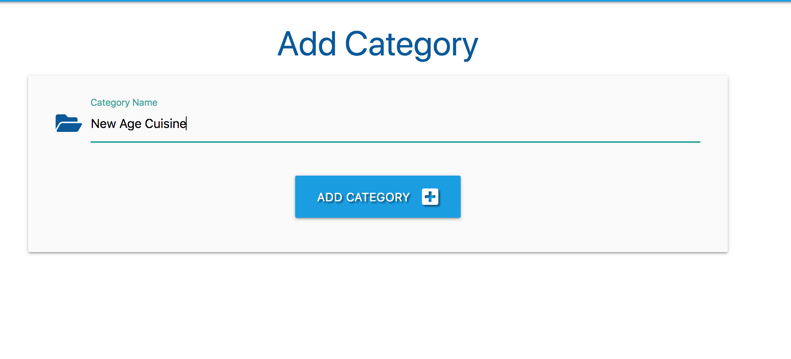

## Introduction

This is the milestone project that I have created for the “Data Centric Development” module, which is part of “Full Stack Web Development Course” offered by Code Institute.

I love cooking and trying new recipes. I usually collect recipes from Youtube and other public sites and adapt them to my taste. This was a perfect opportunity to build a cookbook application where I can save all my favorite recipes at one source and share with my friends who ask me for recipes. 
It also allows others to add and store their recipes securely. The link for the site is here: http://flask-project-milestone-3.herokuapp.com/login

## User Stories

As a regular user, I want to be able to:

-Register as a new user

-View the recipes from any device (mobile, tablet, desktop).  

-See recipes from other users to get new ideas.  

-View all recipes as a Guest.  

-Search any specific recipe.  

-Login and add my recipes.[Create]  

-Get the instruction to make a dish from this site.[Read]  

-Edit the recipes I've added.[Edit]  

-Delete the recipes I've submitted.[Delete]    

As an admin user, I want to be able to:  

-Manage categories i.e. add new categories, edit existing ones & delete old ones

## Design Framework

Materialize 1.0.0

To get a modern and clean layout, I used Materialize as a framework.

jQuery 3.4.0

Used to manipulate the DOM, for example buttons, and showing / hiding elements

Flask 1.0.2

Flask is the micro web framework that runs the application

## Database
For the database, I chose MongoDB and this was a great opportunity to get experience using NoSQL database MongoDB.

See the database schema here

The database is made up of the following collections

*categories*

   id: <ObjectId()>

   category_name: <string>

*tasks*
   
   id: <ObjectId()>

   category_name: <string>
   task_name: <string>
   task_description: <string>
   created_by: <string>

*users*

  id: <ObjectId()>
  
  username: <string>
  
  password: <string>

## Color Scheme
For the color scheme, I've used blue in the navbar. I chose green and red for some buttons and headings to highlight. 

## Typography
The following font was used:

Arial

## Icons
Materialize icons was used for this project.

## Wireframes
Mock-ups were created early on in this project.

## Features
Existing Features

For visitors to the site who are not logged in, the following links are available for them to use.

a. Home

b. Login

c. Register

For users who are logged in, the list of items is as follows:

a. Home

b. Profile

c. New Recipe

d. Logout

For admin users, the list of items is:

a. Home

b. Profile

c. New Recipe

d. Manage Categories

e. Logout

Register User

Users can use the site as a guest, but some features are not available unless logged in.I have built-in authentication and authorization to check certain criteria is met before an account is validated. All passwords are hashed for security purposes!

When a user registers,they are automatically logged in and directed to the Profile page.

Log In to Account

The login page has an input form like register form where the users will enter their username and password.

If the username is not registered or if the password is incorrect an error message will appear.

New users can click on the link "Register here" to get redirected to the register page.

Log Out of Account

Users can easily log out of their account with the click of a button.

Home

On the home page, all recipes are displayed.

Search recipe

If a user would like to search for something specific, there is a search functionality on the home page.

New Recipe

[CRUD] Create or 'add' a new recipe.

Logged in users can add their recipes.

View Recipe

[CRUD] Read or 'review' recipes, from the home page.

Update Recipe

[CRUD] Update or 'edit' their own user recipes from the home page.

Delete Recipe

[CRUD] Delete or 'remove' a user's own recipes.

If the user clicks the Done button, the user can delete a recipe.

Manage Categories 

A user with admin access can login and add, edit or delete a category. 

## Technologies Used

Languages

HTML used as the markup language

CSS used as the base for cascading styles.

JavaScript used mostly for DOM manipulation

Python3 used to run the backend application

Libraries
Google Fonts provided the fonts used throughout the project

Font Awesome v5.8.2 to provide the icon set

Materialize v1.0.0 used as the CSS framework for the project

jQuery used as the primary JavaScript functionality.

Flask v1.0.2 is the micro web framework that runs the application

Jinja v2.10.1 is the default templating language for flask and is used to display data from the python application in the frontend html pages

PyMongo 2.3.0 was used to enable the python application to access the Mongo database

Tools

MongoDB Atlas is used to store my database in the 'cloud'.

Git is used for version control

GitHub provides hosting for software development version control using Git

Balsamiq was used to create the wireframes when initially planning this project

Am I Responsive to create the images in this readme file.

## Hosting
Heroku is used to host the app

## Testing
Most of the testing was manual testing during the development of the site with additional testing completed at the end, before this write up.

Friends and family have also tested by creating accounts and using the site on their own devices. They have tested how the page displays, registered their own accounts, added their recipes, edited and deleted.

To test the site yourself, you can

Browse as a guest, but with limited functionality.

Create your own user. 

Use an existing user to see how the app handles user recipes

You can do this with:

Username: siobhan Password: testpassword

or Admin User

Username : Admin Password: ungoo4La

Validation Services
The following validation services were used to check the validity of the website code.

W3C Markup Validation was used to validate HTML.

Unfortunately the W3C Validator for HTML does not understand the Jinja templating syntax, so it therefore shows a lot of errors with regards to {{ variables }},  , etc. Aside from the Jinja warnings and errors, all of the remaining code is perfectly validating. Also due to the Jinja templating, certain elements cannot be 'beautified' across multiple lines, and must remain on a single line.

W3C CSS validation was used to validate CSS.

JSHint was used to validate JavaScript.

The JS file was run through jshint.com and outside of numerous instances of $ being undefined due to using jQuery, there were no errors.

PEP8 Online was used to validate Python.

app.py file is completely PEP8 compliant!

Responsiveness
Chrome DevTools and physical devices were used throughout development for a number of purposes, one of which was to test the responsiveness and rendering across a range of sizes and devices. As issues were found they were either fixed at the time or noted and returned to later.

The site has been tested successfully on

Apple Macbook Air - Safari browser
Apple iPhone 6,7 &8S - Safari Browser
iPad Mini - Safari Browser
Desktop - Chrome v.74
Desktop - Firefox v.67

## Features Testing
Creating an Account

1. I've created my own account, and other accounts to confirm authentication and validation for creatiing account and all worked as expected.

On registering an account, the user receives a message saying "Registration successful".

2. Log In To An Admin Account

A user can login into an Admin account to see the full functionality of the menu. 

Upon logging in, there are 5 options on the navbar including 'manage categories' which is exclusive to the admin view. The user is directed to the Profile page.

3. Log Out

Upon logging out of the application, a user receives a notification saying "You have been logged out".

4. New Recipe 

I have successfully added new recipes.

These recipes are then visible on the home page and can be edited or deleted from there.

5. Search functionality

I have searched for recipes using the search functionality on the home page. Results come back correctly.

6. Manage Categories

I have successfully added categories. 

## Deployment
Deployment To Heroku
In order the deploy my project to Heroku I have completed the following steps:

Created a Procfile with the command echo web: python run.py > Procfile.
Created a requirement.txt file so Heroku know what python modules it will need to run my application with the command sudo pip freeze --local > requirements.txt
Then git add and git commit the new prerequisites from the requirements.txt file and Procfile, then 'git push' the undertaking to GitHub.
Created config Vars such as my Secret Key, IP PORT and MONGO_URI within .bashrc so I could still run the project from my own IDE
Heroku

After logging into heroku I created a new app, using the name flask-project-milestone-3 and set the region to Europe.

Select application

In the settings tab I clicked reveal config vars and entered the required environment variables, which in this case were:

IP 0.0.0.0

PORT 5000

MONGO_URI mongodb+srv://root:<password_removed>@myfirstcluster-fai9p.mongodb.net/cook_book?retryWrites=true&w=majority

SECRET secret key for flask session

From the heroku dashboard of the newly created application, click on "Deploy" > "Deployment method" and select GitHub.

Confirm the linking of the heroku app to the correct GitHub repository.

In the heroku dashboard, click "Deploy".

In the "Manual Deployment" section of this page, made sure the master branch is selected and then click "Deploy Branch".

The site is now successfully deployed.

Local Deployment
Should you wish the run a local copy of this application of your local machine, you will need to follow the instructions listed below:

Tools you may need:

Python 3 installed on your machine https://www.python.org/downloads/

PIP installed on your machine https://pip.pypa.io/en/stable/installing/

Git installed on your machine: https://gist.github.com/derhuerst/1b15ff4652a867391f03

A text editor such as https://code.visualstudio.com/ Visual Studio Code

An account at https://www.mongodb.com/cloud/atlas MongoDB Atlas or MongoDB running locally on your machine

To deploy locally on your own machine, follow these steps:

Save a copy of the repo on your local machine or use git clone and cd into the correct folder using the terminal.

Create a virtual environment, using python -m venv venv where the 2nd venv is the environment name.

Activate the virtual environment with venv\Scripts\activate

Install any required modules with pip install -r requirements.txt

Within the file app.py change the line app.config['SECRET_KEY'] = os.getenv('SECRET') to app.config['SECRET_KEY'] = os.getenv('SECRET', '<your_key>) where <your_key> is a secret key of your choosing.

Also change app.config["MONGO_URI"] = os.getenv('MONGO_URI') to app.config["MONGO_URI"] = os.getenv('MONGO_URI', ) where is the string that points to your own MongoDB.

Your database should be named cook_book with collections set up as outlined in the database design section of this document. To help, you can also refer to these included JSON examples

From the terminal you can then run the app with python app.py and view in a browser at http://127.0.0.1:5000/

## Credits

Content
The recipes for the cookbook were sourced from various sources.

The text for some of the recipe categories was taken from Wikipedia.

## Acknowledgements
Tutorials

https://www.tutorialspoint.com

https://stackoverflow.com

https://www.youtube.com/watch?v=vVx1737auSE - To understand how to create the login/register functions.

https://www.quackit.com/mongodb/tutorial/mongodb_sort_query_results.cfm

Special thanks to Guido Cecilio Garcia, my Code Institute mentor, for his guidance and advice whilst working on this project.

